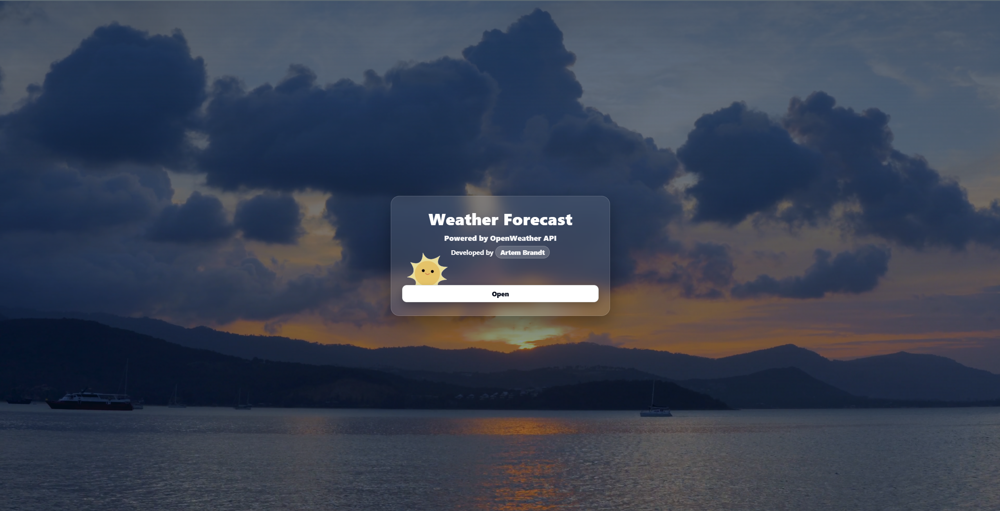
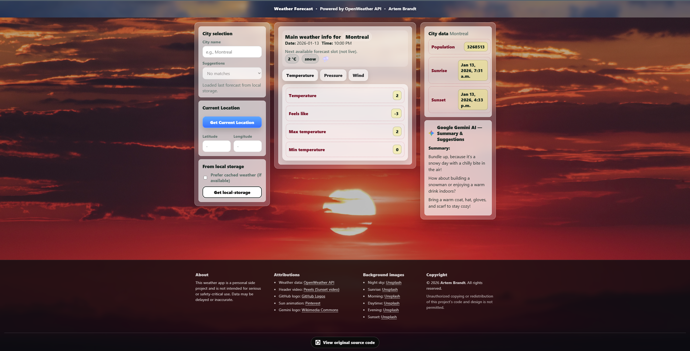

# Weather Forecast Web App — OpenWeather & Gemini AI

🔗 **Live Demo (Render):**  
https://weather-api-project-ptff.onrender.com/
> ⚠️ **Desktop Experience Recommended**  
> This application is currently optimized for desktop and laptop screens.  
> Mobile responsiveness is partially implemented and will be improved in future iterations.

This repository contains a **Weather Forecast Web Application**, a full-stack project built using **Vite + vanilla JavaScript on the frontend** and **Node.js + Express on the backend**.

The application allows users to search for cities, view detailed weather forecasts, use geolocation, cache results locally, and receive **AI-generated weather summaries and suggestions powered by Google Gemini** — all while keeping API keys secure on the server.

---

## Project Overview

This project demonstrates a **production-ready weather application** with a clean UI, real-time data, and secure API handling.

Key goals of the project:
- Consume third-party APIs safely (OpenWeather & Gemini)
- Separate frontend and backend responsibilities
- Deploy a single full-stack app using **Render**
- Implement rate limiting and demo usage limits for AI features
- Deliver a polished, user-friendly interface!

> **Note:**  
> This project is intended as a **portfolio and learning project**. Weather data may be delayed or approximate.

---

## Features

### Weather & Location
- City search with autocomplete suggestions
- Current location weather via browser geolocation
- Detailed temperature, pressure, wind, and city metadata

### Google Gemini AI Integration
- AI-generated weather summary
- Activity suggestions based on conditions
- Recommendations on what to bring (clothing & accessories)
- **Rate-limited and demo-restricted** to prevent abuse (please don't hack I don't wanna wake up to thousands on my api bill 😭)

### Performance & UX
- Local storage caching for faster reloads
- Optional cache usage toggle
- Dynamic time-based background (morning, evening, night, etc.)
- Smooth UI transitions and loading states
- Friendly error handling for network and AI limits

### Security
- API keys **never exposed to the client**
- Backend proxy for all third-party requests
- Daily usage limits for Gemini AI
- Request rate limiting via Express middleware

---

## Tech Stack

### Frontend
- JavaScript (ES Modules)
- Vite
- HTML5 / CSS3
- Local Storage API
- Browser Geolocation API

### Backend
- Node.js
- Express
- Express Rate Limit
- Environment variables (.env)
- Secure API proxy architecture

### APIs & Services
- OpenWeather API
- Google Gemini API
- Render (deployment)

---

## Project Structure

```
Weather-API-Project/
│
├── README.md
├── index.html
├── package.json
├── package-lock.json
├── vite.config.js
├── eslint.config.mjs
├── .gitignore
├── .env.example
│
├── server/
│   └── server.mjs                 # Express backend (Gemini + OpenWeather proxy)
│
├── assets/
│   ├── gifs/
│   │   └── transparent-sun-animation.gif
│   │
│   ├── images/
│   │   ├── GitHub-Mark.png
│   │   ├── Google_Gemini_icon_2025.svg.png
│   │   ├── project-screen1.png
│   │   └── project-screen2.png
│   │
│   └── video/
│       ├── project-video-showcase.mp4
│       └── weather-background.mp4
│
├── public/
│   └── changing-backgrounds/
│       ├── daytime.jpg
│       ├── evening.jpg
│       ├── morning.jpg
│       ├── night.jpg
│       ├── sunrise.jpg
│       └── sunset.jpg
│
├── css/
│   ├── components.css
│   ├── layout.css
│   ├── reset.css
│   └── theme.css
│
└── js/
    ├── main.mjs                   # App entry point
    ├── tabs.js
    ├── utils.mjs
    │
    ├── services/
    │   ├── gemini.mjs             # Gemini AI frontend service
    │   ├── geolocation.mjs
    │   ├── openweather.mjs
    │   └── storage.mjs
    │
    └── ui/
        ├── background.mjs         # Dynamic background logic
        ├── dom.mjs
        └── render.mjs

```

---

## How to Run Locally

### 1) Clone the repository
```bash
git clone https://github.com/artembrandt03/Weather-API-Project.git
cd Weather-API-Project
```

### 2) Install dependencies
```bash
npm install
```

### 3) Create environment variables
Create a `.env` file at the project root:
```env
OPENWEATHER_API_KEY=your_openweather_key
GEMINI_API_KEY=your_gemini_key
```

### 4) Run the app in development
```bash
npm run dev
```

---

## Media

### Project Screens



### Video Showcase
[▶️ Click here to watch the video showcase](assets/video/project-video-showcase.mp4)

---

## Deployment

The project is deployed as a **single full-stack service** on **Render**:

https://weather-api-project-ptff.onrender.com/

---

## Future Improvements

Planned enhancements for future versions of this project include:

- **Mobile UI Optimization**  
  Improve layout scaling, spacing, and component stacking for smaller screens.

- **Responsive Background Handling**  
  Optimize background images and videos for mobile performance and bandwidth.

- **Extended Weather Data**  
  Add hourly forecasts, precipitation probability, and weather alerts.

- **Testing & Validation**  
  Add automated tests for API services and UI logic.

## Author

**Artem Brandt**  
Computer Science Student — Dawson College  
Portfolio Project (2026)

© 2026 Artem Brandt. All rights reserved.
